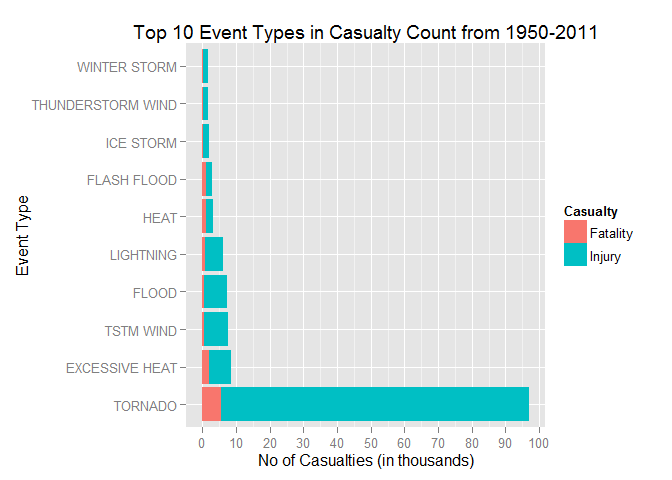
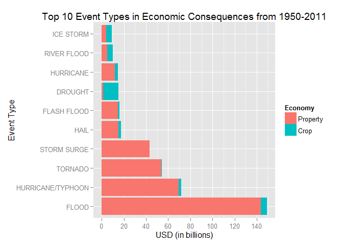

# Most Harmful Types of Weather Event on Population Health & Economy in US between 1950 and 2011
Raeger Tay  
22 July 2015  

##Synopsis
The aim of this paper is to identify the most harmful types of weather event on the population health as well as the economy in US between 1950 and 2011. The dataset used in this analysis is the Storm Data prepared by US National Weather Service. For the subject on population health, the event types are ranked according to the number of casualties. A casualty is defined as a person who is either dead or injured from the weather event. The most harmful event types identified are "Tornado", "Excessive Heat" & "TSTM Wind" among others. On the economy, the consequences of weather events are assessed based on the total monetary damage incurred on properties and crops. The worst event types identified are "Flood", "Hurricane/Typhoon" & "Tornado" among others. Finally, the event types that are most harmful to the country are identified based on the intersection of the previous two analysis, and "Tornado" tops the list.

##Data Processing

[Storm Data](https://d396qusza40orc.cloudfront.net/repdata%2Fdata%2FStormData.csv.bz2)  
[National Weather Service Storm Data Documentation](https://d396qusza40orc.cloudfront.net/repdata%2Fpeer2_doc%2Fpd01016005curr.pdf)  
[National Climatic Data Center Storm Events FAQ](https://d396qusza40orc.cloudfront.net/repdata%2Fpeer2_doc%2FNCDC%20Storm%20Events-FAQ%20Page.pdf)  


The packages used in this analysis are "dplyr", "ggplot2", and "reshape2".  

```r
library(dplyr)
library(ggplot2)
library(reshape2)
```

The dataset is first loaded and some inspections are performed.

```r
dat <- read.csv('repdata-data-StormData.csv.bz2')
dat <- tbl_df(dat)
dim(dat)
```

```
## [1] 902297     37
```

```r
names(dat)
```

```
##  [1] "STATE__"    "BGN_DATE"   "BGN_TIME"   "TIME_ZONE"  "COUNTY"    
##  [6] "COUNTYNAME" "STATE"      "EVTYPE"     "BGN_RANGE"  "BGN_AZI"   
## [11] "BGN_LOCATI" "END_DATE"   "END_TIME"   "COUNTY_END" "COUNTYENDN"
## [16] "END_RANGE"  "END_AZI"    "END_LOCATI" "LENGTH"     "WIDTH"     
## [21] "F"          "MAG"        "FATALITIES" "INJURIES"   "PROPDMG"   
## [26] "PROPDMGEXP" "CROPDMG"    "CROPDMGEXP" "WFO"        "STATEOFFIC"
## [31] "ZONENAMES"  "LATITUDE"   "LONGITUDE"  "LATITUDE_E" "LONGITUDE_"
## [36] "REMARKS"    "REFNUM"
```

The dataset consists of 37 variables and 902297 observations. The 7 variables that are relevant to the analysis are as follows:  

* EVTYPE - type of weather event
* FATALITIES - number of fatalities 
* INJURIES - number of injuries 
* PROPDMG - coefficient for the property damage 
* PROPDMGEXP - multiplier for PROPDMG 
* CROPDMG - coefficient for crop damage
* CROPMDGEXP - multiplier for CROPDMG 


```r
with(dat, sum(is.na(FATALITIES)))
```

```
## [1] 0
```

```r
with(dat, sum(is.na(INJURIES)))
```

```
## [1] 0
```

```r
with(dat, sum(is.na(PROPDMG)))
```

```
## [1] 0
```

```r
with(dat, sum(is.na(CROPDMG)))
```

```
## [1] 0
```
There are no missing values for the relevant variables.  
<br>

```r
n_distinct(dat$EVTYPE)
```

```
## [1] 985
```
Given that there are 985 distinct event types, this paper aims to identify the top 1% most harmful types, which amounts to 10 event types.

### Population Health
The 10 event types with the highest casualty counts are extracted. The casualty count is calculated by summing the number of fatalities and injuries. Casualty count is preferred to either the individual fatality or injury count as it accounts for all the people harmed in the weather events, regardless if it results in death. The average casualty count is used to break tie, if any. The summarised data is as shown below.

```r
casualty_top10 <- dat %>%
        group_by(EVTYPE) %>%
        summarise(casualty.total = sum(FATALITIES, INJURIES), 
                  casualty.mean = sum(FATALITIES, INJURIES)/n(),
                  Fatality = sum(FATALITIES), Injury = sum(INJURIES), 
                  event.count = n()) %>%
        arrange(desc(casualty.total), desc(casualty.mean)) %>%
        head(10)
options(dplyr.width = Inf)
casualty_top10 
```

```
## Source: local data frame [10 x 6]
## 
##               EVTYPE casualty.total casualty.mean Fatality Injury
## 1            TORNADO          96979    1.59894150     5633  91346
## 2     EXCESSIVE HEAT           8428    5.02264601     1903   6525
## 3          TSTM WIND           7461    0.03392289      504   6957
## 4              FLOOD           7259    0.28662244      470   6789
## 5          LIGHTNING           6046    0.38377555      816   5230
## 6               HEAT           3037    3.95958279      937   2100
## 7        FLASH FLOOD           2755    0.05075815      978   1777
## 8          ICE STORM           2064    1.02891326       89   1975
## 9  THUNDERSTORM WIND           1621    0.01963349      133   1488
## 10      WINTER STORM           1527    0.13356075      206   1321
##    event.count
## 1        60652
## 2         1678
## 3       219940
## 4        25326
## 5        15754
## 6          767
## 7        54277
## 8         2006
## 9        82563
## 10       11433
```


### Economy
Taking a look at the damage multiplier.

```r
levels(dat$PROPDMGEXP)
```

```
##  [1] ""  "-" "?" "+" "0" "1" "2" "3" "4" "5" "6" "7" "8" "B" "h" "H" "K"
## [18] "m" "M"
```

```r
levels(dat$CROPDMGEXP)
```

```
## [1] ""  "?" "0" "2" "B" "k" "K" "m" "M"
```
The multipliers come in various characters, ranging from "blank" character to symbols and letters. For the purpose of extracting the highest damage, only the "B", "M" and "m" multiplier are used in the calculation. They represent billion and million for the latter two. The rest can be safely ignored as their magnitudes are at least a [few order smaller][1].

[1]: https://rstudio-pubs-static.s3.amazonaws.com/58957_37b6723ee52b455990e149edde45e5b6.html "few order smaller"

<br>
The 10 event types with highest total damage are extracted. Total damage is calculated by multiplying the property and crop coefficent with their respective multiplier. The total damage is preferred to either the individual property or crop damage as it accounts for a more complete representation of the economy. The data is as summariesed below.

```r
expTable <- data.frame(exp = c("B", "M", "m"), value = c(9, 6, 6))
economic_top10 <- dat %>% 
        filter(PROPDMGEXP %in% expTable$exp | CROPDMGEXP %in% expTable$exp) %>%
        mutate(prop_expValue = expTable$value[match(PROPDMGEXP, expTable$exp)],
               crop_expValue = expTable$value[match(CROPDMGEXP, expTable$exp)],
               Property = PROPDMG * 10^prop_expValue, Crop = CROPDMG * 10^crop_expValue) %>%
        group_by(EVTYPE) %>%
        summarise(dmg.total = sum(Property, Crop, na.rm = TRUE), dmg.mean = dmg.total/n(),
                  Property = sum(Property, na.rm = TRUE), Crop = sum(Crop, na.rm = TRUE), 
                  event.count = n()) %>%
        arrange(desc(dmg.total)) %>%
        head(10)
economic_top10       
```

```
## Source: local data frame [10 x 6]
## 
##               EVTYPE    dmg.total   dmg.mean     Property        Crop
## 1              FLOOD 149278610000   88069976 143779180000  5499430000
## 2  HURRICANE/TYPHOON  71908040000 1198467333  69303870000  2604170000
## 3            TORNADO  54089090000   11990488  53773680000   315410000
## 4        STORM SURGE  43304930000  984202955  43304930000           0
## 5               HAIL  17505990000   12986639  15057160000  2448830000
## 6        FLASH FLOOD  15978340000    9998961  14734980000  1243360000
## 7            DROUGHT  14994170000   96736581   1043050000 13951120000
## 8          HURRICANE  14598280000  175882892  11858970000  2739310000
## 9        RIVER FLOOD  10131200000  595952941   5105200000  5026000000
## 10         ICE STORM   8903310000   56350063   3882860000  5020450000
##    event.count
## 1         1695
## 2           60
## 3         4511
## 4           44
## 5         1348
## 6         1598
## 7          155
## 8           83
## 9           17
## 10         158
```


##Results


```r
casualty_top10$EVTYPE <- with(casualty_top10, factor(EVTYPE, as.character(EVTYPE)))
casualty_top10 <- melt(casualty_top10, 
                       id.vars = c("EVTYPE", "casualty.total", "casualty.mean", "event.count"), 
                       variable.name = "Casualty")
g1 <- ggplot(data = casualty_top10, aes(EVTYPE, value/1000, fill = Casualty)) 
g1 + geom_bar(stat = "identity") +
        labs(x = "Event Type", y = "No of Casualties (in thousands)", 
             title = "Top 10 Event Types in Casualty Count from 1950-2011") +
        scale_y_continuous(breaks = seq(0,100,10)) +
        coord_flip()
```

 

Figure 1 shows that the top-placed event type "Tornado" has more than 10 times the casualty counts compared to the second-placed "Excessive Heat". This is due to its relatively high casualty mean and event count, both in 3rd place in the list. It is also worth noting that a large percetange of casualties do not result in death, as illustrated in the figure.


```r
economic_top10$EVTYPE <- with(economic_top10, factor(EVTYPE, as.character(EVTYPE)))
economic_top10 <- melt(economic_top10, 
                       id.vars = c("EVTYPE", "dmg.total","dmg.mean", "event.count"), 
                       variable.name = "Economy")
g2 <- ggplot(data = economic_top10, aes(EVTYPE, value/1000000000, fill = Economy)) 
g2 + geom_bar(stat = "identity") +
        labs(x = "Event Type", y = "USD (in billions)", 
             title = "Top 10 Event Types in Economic Consequences from 1950-2011") +
        scale_y_continuous(breaks = seq(0,150,20)) +
        coord_flip()
```

 

Figure 2 shows that most of the economic consequences from the weather events are due to property damages, with the exception of "Drought".

<br>

Finally, the events that are repeated in both figures are as follows.

```r
intersect(casualty_top10$EVTYPE, economic_top10$EVTYPE)
```

```
## [1] "TORNADO"     "FLOOD"       "FLASH FLOOD" "ICE STORM"
```
Overall, these four event types are most harmful to the country in general.

##Conclusion
This paper has explored the most harmful weather event types in terms of population health and the economy. The top 10 most harmful event types for each category are presented. The most harmful event types to the country are then found by the intersection of the above 2 categories.


## References

* https://d396qusza40orc.cloudfront.net/repdata%2Fdata%2FStormData.csv.bz2
* https://d396qusza40orc.cloudfront.net/repdata%2Fpeer2_doc%2Fpd01016005curr.pdf
* https://d396qusza40orc.cloudfront.net/repdata%2Fpeer2_doc%2FNCDC%20Storm%20Events-FAQ%20Page.pdf
* https://rstudio-pubs-static.s3.amazonaws.com/58957_37b6723ee52b455990e149edde45e5b6.html

*The codes in this paper are ran with R Version 3.2.1 in Windows 8.1.*
